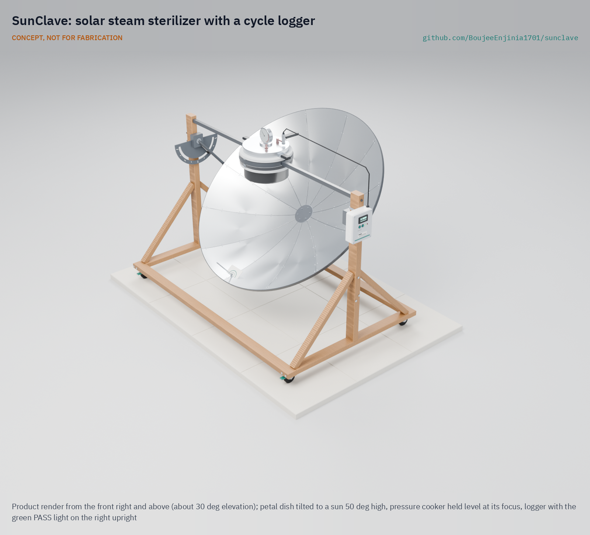

# SunClave

     

**Area:** BioMedical · **TRL:** 3 of 9 (proof of concept on paper) · **Prototype budget:** $450 USD · **Difficulty:** 3 of 5

Solar concentrator that heats a modified pressure-cooker autoclave, with a calibrated temperature, pressure and time logger that records every cycle.

[Exploded render](media/render-exploded.png) · [Detail render](media/render-detail.png) · [Interactive 3D model](media/viewer.html) · [Concept blueprint (PDF)](media/concept-blueprint.pdf) · [General arrangement SCL-DWG-001 (PDF)](cad/drawings/SCL-DWG-001.pdf) · [Calculation note](docs/04-calcs/01-sizing.md) · [Review note](docs/REVIEW.md)

## Concept rationale

A pressure cooker already reaches autoclave conditions, and a 1.4 m solar dish of the kind used for cooking already delivers several hundred watts of heat to a pot. What clinics without power lack is not only the heat but proof that each load was treated, so SunClave pairs a household cooker at the focus of a petal dish with a small logger that checks for saturated steam and times the hold. The cooker stays level while the dish tilts around it, and the operator aims by a shadow, so nobody looks into the focus.

The design is open and garage-buildable because the people who would maintain it are district workshops and biomedical technicians, not a manufacturer's service network. Every structural part is bent flat bar, timber and aluminum sheet joined with bolts and rivets, the only bought pressure part is a commercially rated cooker, and the logger uses common modules. Publishing the geometry, the calculations and the logger's pass criteria lets anyone check the safety case before building one.

## Burning platform

The World Health Organization estimates that close to 1 billion people in low- and lower-middle-income countries are served by health facilities without reliable electricity; in sub-Saharan Africa about 15 % of facilities have no electricity at all and only about 40 % have a reliable supply ([WHO, 2023](https://www.who.int/news-room/fact-sheets/detail/electricity-in-health-care-facilities)). An electric autoclave is out of reach in those facilities, so instruments are boiled, soaked or steamed without any record of the conditions reached.

The consequences show up in infection rates. WHO reports that in low- and middle-income countries 11 % of patients who undergo surgery are infected in the process, and that in Africa up to 20 % of women who have a caesarean section contract a wound infection ([WHO, surgical site infections](https://www.who.int/news-room/questions-and-answers/item/surgical-site-infections)). Instrument reprocessing is one of several links in that chain, and the one that heat plus a record can address directly.

## Where it could be used

As a research and educational prototype, SunClave is a platform for studying off-grid steam sterilization and cycle records; it is not a medical device.

### By industry

| Industry | Use |
| --- | --- |
| Rural primary health care | Research on solar steam cycles and per-load records at health posts without grid power |
| Maternity and midwifery programs | Studying how delivery kits could be reprocessed and logged during daylight |
| Dental and eye outreach | Temporary camps that need instrument reprocessing for a few days at a site |
| Humanitarian and disaster response | Field clinics after grid failures, alongside the stove backup the design already allows |
| Veterinary field practice | Rural livestock and animal-health services reprocessing surgical instruments |
| Biomedical engineering education | Teaching optics, steam thermodynamics, pressure safety and measurement uncertainty on one open design |

### By country or region

| Country or region | Why it matters there |
| --- | --- |
| Kenya and the East African highlands | Highland facilities sit above sea level, where a 103.4 kPa cooker falls short of 121 °C and the logger extends the hold; in sub-Saharan Africa only about 40 % of facilities have reliable electricity ([WHO](https://www.who.int/news-room/fact-sheets/detail/electricity-in-health-care-facilities)) |
| Nepal | Hill and mountain health posts combine altitude with weak grids; about 12 % of health facilities in South Asia have no electricity ([WHO](https://www.who.int/news-room/fact-sheets/detail/electricity-in-health-care-facilities)) |
| Niger (Sahel) | Daily solar irradiation averages about 7 kWh/m², and in 2018 only about 13 % of the population, and about 1 % in rural areas, had access to electricity ([African Development Bank, Desert to Power roadmap for Niger, 2020](https://www.afdb.org/sites/default/files/2024/08/23/desert-to-power_dtp_roadmap_for_niger_en_oct2020.pdf)) |
| Peru and Bolivia (Andes) | In Latin America and the Caribbean about 8 % of health facilities have no electricity and only about 72 % have a reliable supply ([WHO](https://www.who.int/news-room/fact-sheets/detail/electricity-in-health-care-facilities)); highland sites would test the extended-hold method at high altitude |
| Puerto Rico, United States | A high-income case: after Hurricanes Irma and Maria in 2017 it took about 11 months to restore power to all customers in Puerto Rico ([US Government Accountability Office, GAO-19-296](https://www.gao.gov/products/gao-19-296)), a reminder that grid failure also reaches health systems in wealthy economies |

## What sparked the idea

The starting point was two French inventions a year apart. At the 1878 Paris Exposition, Augustin Mouchot won a gold medal for what was then the world's largest parabolic solar collector, which focused sunlight onto a blackened copper vessel of water to raise steam ([Bureau International des Expositions](https://bureauinternationaldesexpositions.bie-paris.org/site/en/latest/blog/entry/expo-1878-paris-the-revelation-of-sun-power)). In 1879 Charles Chamberland, working with Louis Pasteur, introduced the autoclave for medical and scientific use, a descendant of Denis Papin's 1679 high-pressure cooker ([Smithsonian National Museum of American History](https://americanhistory.si.edu/collections/object/nmah_536)). SunClave puts the two back together: a blackened vessel at the focus of a parabolic dish, where the vessel is Papin's pressure cooker doing Chamberland's job, with a logger added so every cycle leaves a record.

## Problem

Rural clinics lack power to sterilize instruments in an autoclave. Close to 1 billion people are served by health facilities with no or unreliable electricity, and where instruments are steamed in a pressure cooker on a fire, nothing records whether each load reached sterilizing conditions. Full problem statement: [docs/01-problem.md](docs/01-problem.md)

## Concept

A 1.4 m parabolic dish of aluminum petals focuses sunlight onto the blackened base of a 12 L pressure cooker held level at the focus while the dish tilts around it. A cycle logger reads a Pt100 probe in the load zone and an absolute pressure transducer, checks that the chamber holds saturated steam, times the hold and shows PASS or FAIL for each cycle. The TRL 3 calculation note puts about 670 W into the cooker at 700 W/m² of direct sun, about 79 min from a cold start to the end of a 30 min hold, and about four cycles on a clear day, for about $440 in parts against a $450 budget. A 103.4 kPa (15 psi) cooker reaches 121 °C only at sea level, so above it the logger extends the hold, records the real temperature and reminds the operator to trim the dish to save water. With Amish's decisions of 2026-09-25 (retarget every 12 min, a 45 kg limit, the whole vessel treated as a marked hot zone, four locking castors and a 0 to 300 kPa transducer), no requirement is missed on paper; cycle time and wind stability remain at risk. Details are in the [review note](docs/REVIEW.md).

Full design precis: [docs/02-concept.md](docs/02-concept.md) · Requirements: [docs/03-requirements.md](docs/03-requirements.md)

## Key components

- 1.4 m petal dish on a tilting yoke and a timber stand on four locking castors
- 12 L aluminum pressure cooker with weighted regulator, fixed level holder and insulated jacket
- Pressure gauge and independent relief valve
- Pt100 load-zone probe and absolute pressure transducer through a lid gland
- Cycle logger on a USB power bank with pass or fail per cycle, and retarget and trim reminders
- Shadow gnomon for aiming without looking at the sun
- Goggles, a parking cover and keep-out marking for the hot zone

The priced bill of materials is in [bom/bom.csv](bom/bom.csv); the parametric model is `cad/src/model.py`.

## Safety

> This is a research and educational prototype. It is not a medical device, has not been cleared or approved by any regulator, and must not be used to diagnose, treat or monitor any person. This design involves concentrated sunlight that can burn skin and eyes and start fires, and heat and pressurized steam. Keep operating pressure and water volume below local boiler and pressure vessel code thresholds, fit a certified relief valve, and never operate it unattended.

## Repository layout

| Folder | Contents |
| --- | --- |
| `docs/` | Problem, concept, requirements, calculations and design decisions |
| `cad/src/` | build123d Python source, the source of truth for all geometry |
| `cad/step/`, `cad/stl/` | Exported models for FreeCAD, other CAD tools and printing |
| `cad/drawings/` | 2D sketches and dimensioned drawings |
| `bom/` | Bill of materials |
| `electronics/` | KiCad schematics and PCB layouts |
| `firmware/` | Microcontroller code |
| `media/` | Renders, perspectives and photos |
| `build-log/` | Dated prototyping notes |

## Documentation

Controlled documents follow the portfolio [documentation standard](.kit/STANDARDS.md). Each carries a document ID (SCL-PRC-001 for the precis), a version and a revision history. Branded PDFs are built with `python .kit/render.py` and attached to GitHub Releases when a document is tagged, for example `SCL-PRC-001/v1.0`.

## Credits

Designed by Amish Chadha. See [CONTRIBUTORS.md](CONTRIBUTORS.md) for roles. To cite this design, use [CITATION.cff](CITATION.cff) (GitHub shows it as "Cite this repository").

AI assistance (Claude) was used to accelerate concept renders, prototype documentation and first-pass sizing calculations. Design direction and all decisions are Amish Chadha's, recorded in this repository's decision records (`docs/decisions/`).

## Licenses

- **Hardware** (CAD, drawings, BOM, electronics): [CERN-OHL-S v2](LICENSE)
- **Software** (firmware, scripts, notebooks): [MIT](LICENSE-SOFTWARE)

A project of the [Design Molecule](https://designmolecule.com) lab.
