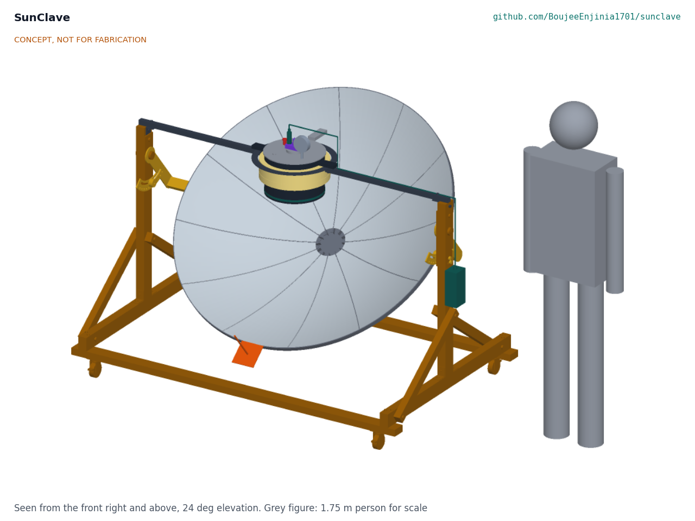
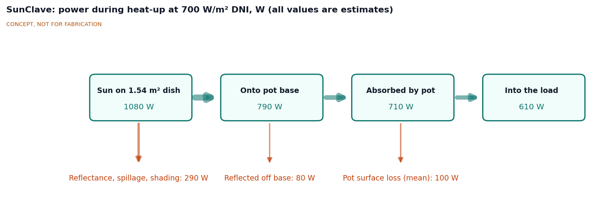
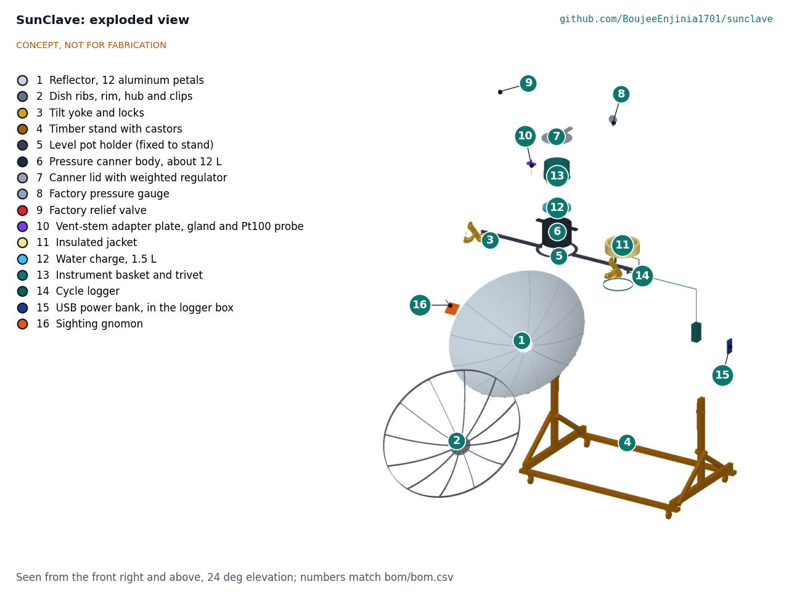
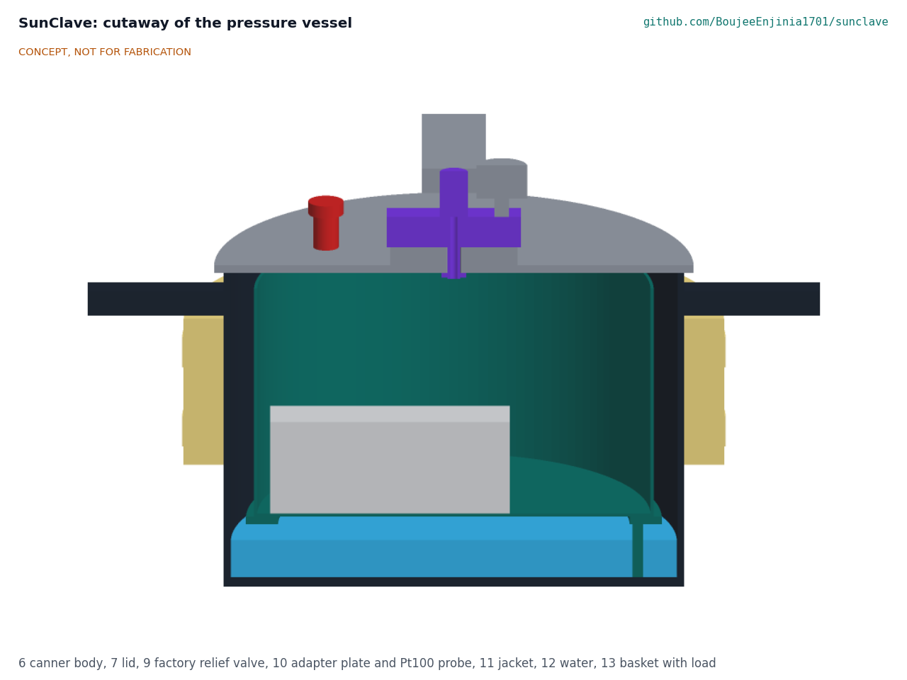

# SunClave design precis

SunClave is a 1.4 m parabolic dish of aluminum petals that focuses sunlight onto the blackened base of a pressure canner of about 12 L held level at the focus, with a cycle logger that measures temperature in the load zone and chamber pressure and flags each cycle as pass or fail. The TRL 3 calculations (SCL-CAL-001) put about 660 W into the canner on a clear day, enough to go from cold to the end of a 30 min hold in about 81 min and to run about four cycles between 09:00 and 15:00. On 2026-09-25 Amish accepted the recommendations on the TRL 3 findings (SCL-DDR-002): the dish is retargeted every 12 min, the mass limit is 45 kg, the whole vessel is treated as a marked hot zone instead of guarding the focus, all four castors lock, a trimming rule protects the water at altitude and the pressure transducer spans 0 to 300 kPa. On paper no requirement is now missed; cycle time (R4) and wind stability (R15) remain at risk. On 2026-10-01 the design was made constructable (SCL-DDR-003, accepted by Amish on 2026-10-02): every part can be cut, bent, drilled or bought and every joint is bolted or riveted, and the prototype build plan (SCL-BLD-001) shows how. On 2026-10-02 Amish decided the lid fittings (a canner with its own gauge and relief valve, the lid never drilled, the probe and pressure sensor on a vent-stem adapter plate) and a back-up drop pin for the tilt locks; both are now in the model. Value-engineering target: USD 450. Estimated cost of the constructable design: USD 528 (USD 78 over the target).

> **Safety:** SunClave is a research and educational prototype, not a medical device. It has not been cleared or approved by any regulator and must not be relied on to sterilize instruments used on patients. It combines concentrated sunlight that can burn skin, blind and start fires, with a pressure vessel holding steam at about 121 °C (250 °F). See the safety section before building or operating anything.

*Figure 1. SunClave with the dish aimed at a sun 50 degrees above the horizon, and a 1.75 m person for scale. The cooker is held level at the focus on a holder fixed to the stand; the dish and yoke tilt about it.*

## How it works

1. **Load.** The operator puts 1.5 L of water in the cooker, sets cleaned instruments in the basket on its trivet above the water, closes the lid and sets the cooker in the level holder at the focus.
2. **Aim.** The operator unlocks the four castors, turns the stand to face the sun, locks them again and tilts the dish until the shadow of the sighting gnomon falls on the center of its target. Nobody needs to look at the sun or at the bright focus. The logger sounds a reminder every 12 min, and retargeting at that interval keeps the absorbed power within 10 % of on-target (SCL-CAL-001 section 3; decided, SCL-DDR-002 item 13).
3. **Heat and purge air.** About 660 W is absorbed by the blackened base and the black band of wall above it. The water boils, and steam leaves through the open vent for at least 5 min to push air out of the chamber before the weighted regulator is fitted. The logger recognizes this purge as a plateau at the local boiling point.
4. **Pressurize and hold.** With the regulator fitted, pressure rises to 103.4 kPa gauge and the regulator vents the excess. The hold is 20 min (unwrapped) or 30 min (wrapped) at sea level, and longer above it (decided option B): the logger computes the hold that gives the same exposure as 121 °C with z = 10 °C and records the real temperature. Whenever the computed hold exceeds 40 min (every site at 1,000 m and above), the logger shows a trim reminder and the operator trims the dish off the sun until the regulator only just vents, which keeps at least 0.5 L of water in strong sun up to 2,400 m (decided, SCL-DDR-002 item 17).
5. **Record.** Throughout, the logger reads a Pt100 probe in the load zone and an absolute pressure transducer on the lid. It checks that the load-zone temperature matches the saturation temperature for the measured pressure (air left in the chamber shows up as a lower temperature), times the hold, and at the end shows PASS or FAIL with a cycle number to copy into the register.
6. **Cool and unload.** The operator turns the dish away from the sun, fits the parking cover if the session is over, lets the pressure fall to zero on the gauge (about 10 min), removes the regulator, opens the lid and lets the load dry in the residual heat.

On cloudy days the same cooker runs on a wood, charcoal or LPG stove and is logged the same way (decided, SCL-DDR-001 item 11).

*Figure 2. Power flow during heat-up at 700 W/m² DNI and a sun 60° high, central estimates from SCL-CAL-001.*

## Main components

Numbers match the exploded view (Figure 3) and `bom/bom.csv`. The general arrangement is drawing SCL-DWG-001 (`cad/drawings/`), generated from `cad/src/model.py`.

| # | Component | Choice | Notes |
| --- | --- | --- | --- |
| 1 | Reflector | 12 petals of polished aluminum sheet 0.5 mm, 1.4 m aperture, focal length 500 mm | SK14-style petal layout (decided) |
| 2 | Dish ribs, rim, hub and clips | Twelve 20 x 3 mm steel flat-bar ribs bent on edge, 25 x 4 mm rim band, 200 mm hub plate, 24 angle clips; petals riveted through their folded flanges | Holds the petal shape (SCL-DDR-003) |
| 3 | Tilt yoke and locks | A 6 mm steel yoke plate each side turning on a fixed 20 mm axle, joined to the rim band by a tube stand-off; a fan on each plate with a slot that a star knob clamps; a drop pin on a lanyard through a row of holes in each fan as a back-up stop | Dish-axis elevation 15 to 90 degrees; the two locks hold up to about 45 N·m of gravity torque (SCL-DDR-003); if a lock slips the pin stops the dish within 7.5 degrees (decided 2026-10-02) |
| 4 | Stand with castors | Bolted treated timber: cross rails, side rails on edge, uprights to 1.10 m and lapped braces; steel axle plates and axles; four locking castors | Timber decided to save cost (SCL-DDR-001 item 2); all four castors lock (SCL-DDR-002 item 16); azimuth by turning the whole stand |
| 5 | Level pot holder | Flat steel ring the body handles rest on, on two tube arms carried on the upright tops | Fixed to the stand: the loaded canner's centre of mass is about 96 mm above the axis, so a swinging holder would be top-heavy |
| 6 | Pressure canner | Aluminum pressure canner of about 12 L sold with a factory gauge and relief valve, about 280 mm inside diameter x 200 mm deep, 103.4 kPa weighted regulator, overpressure plug; base and lowest 80 mm of wall painted matte black | Vessel decided (SCL-DDR-001 item 4); a canner with factory fittings since 2026-10-02 (item 5) |
| 7 | Lid with regulator | Supplied with item 6; carries items 8 and 9 as supplied and the adapter plate (item 10) in its vent-pipe hole | The lid is not drilled: the factory gauge and relief valve stay as supplied, and the probe gland goes on an adapter plate on the vent stem with a bore of 3 mm or more, overpressure plug untouched (decided 2026-10-02, item 5) |
| 8 | Pressure gauge (factory-fitted) | The canner maker's dial gauge, as supplied | Reads without power, independent of the logger; checked against a reference before use |
| 9 | Relief valve (factory-fitted) | The canner maker's relief valve; set 125 kPa gauge or less and seat 4 mm or more to confirm | Passes 5.2 times the worst steam generation if its seat is 4 mm or more |
| 10 | Vent-stem adapter plate, gland and Pt100 probe | Stainless plate in the lid's vent-pipe hole carrying the maker's vent pipe, the transducer and a compression gland for a 3 mm class A Pt100 into the load zone; 6 mm bore round the probe | Measures where the instruments are; the vent stays as open as a 5.2 mm hole; no new hole in the lid |
| 11 | Insulated jacket | 25 mm mineral wool with aluminized skin on the upper wall | Black band and base stay bare to take the focus |
| 12 | Water charge | 1.5 L per cycle | About 1.26 L left after a central sea-level cycle |
| 13 | Instrument basket and trivet | Stainless basket 250 mm diameter x 150 mm deep on a 40 mm trivet | Resized from 270 x 180 mm, which did not fit a 12 L cooker |
| 14 | Cycle logger | ESP32-class board, Pt100 interface with 0.05 % reference, 16-bit ADC, 0 to 300 kPa absolute pressure transducer, base-edge thermocouple, RTC, microSD, OLED display, buzzer | 1 s logging, pass or fail per cycle, boil-dry alarm, 12 min retarget reminder, trim reminder for holds over 40 min; OLED decided to save cost; transducer span decided (SCL-DDR-002 item 18) |
| 15 | Logger power bank | 10,000 mAh USB bank with a low-current mode, kept in the shaded logger box | About 8.7 days per charge; replaces the panel and cell (decided) |
| 16 | Sighting gnomon | Pin parallel to the dish axis over a target plate, on a bracket outside the rim band | Aiming by shadow (decided) |
| 19 | Eye protection | Two pairs of shade 5 goggles | Added for R11 |
| 20 | Parking cover | Opaque cover for the dish | Added for R9 and R11 |
| 21 | Keep-out marking | Barrier tape and four ground pegs marking 2 m around the dish and vessel | Added for the restated R11 (SCL-DDR-002 item 15) |

*Figure 3. Exploded view with numbered callouts matching the BOM. The cooker parts are lifted out along the vertical axis. Items 17 to 21 are not modelled.*

*Figure 4. Section through the pressure vessel: water below the trivet, the basket and instrument load in steam, the Pt100 probe reaching into the load zone, and the jacket on the upper wall above the bare black band.*

## Key numbers (TRL 3)

All values are paper estimates from SCL-CAL-001 (`python docs/04-calcs/sizing.py`) for the design case in SCL-REQ-001 v0.5: 700 W/m² DNI, sun 60° high, 25 °C, wind 2 m/s, sea level, 2.0 kg of instruments, 1.5 L of water.

*Table 1. Headline results, central case unless a range is given.*

| Quantity | Value | Requirement |
| --- | --- | --- |
| Sun on the aperture | 1,078 W (1.539 m²) | |
| Absorbed by the canner | 663 W on target (575 to 716 W across scenarios); 555 W at 15° sun, 733 W overhead | |
| Peak flux on the base | about 270 kW/m² in the hottest 20 mm cell; mean 11 kW/m² | |
| Heat loss at 121 °C | 395 W (black base and band 245 W, lid 101 W) | |
| Cold start to end of 30 min hold | 81 min (72 to 111 min) | R4 at risk |
| Cycles, 09:00 to 15:00 | 4 | R5 met |
| Water left after a 30 min hold | 1.26 L; with the trimming rule 1.31 L at 1,800 m in strong sun (0.15 L untrimmed) | R10 met (restated) |
| Steam temperature at 103.4 kPa gauge | 120.95 °C at sea level; 117.7 °C at 1,800 m (hold 63 min) | R1 not verifiable at TRL 3 |
| Temperature and pressure accuracy | 0.44 °C; 3 kPa | R7 met |
| Air-removal check uncertainty | 0.64 °C against a 2 °C threshold (0 to 300 kPa transducer) | R12 met, narrowly |
| Retarget interval for 90 % of on-target power | about 13 min, against a 12 min target | R14 met (relaxed) |
| Relief valve capacity | 5.2 times the worst steam generation | R8 met |
| Tipping factor at 10 m/s | 1.40 at 15° sun; four locked castors grip 237 N against 153 N | R15 at risk |
| Mass, empty | 44.8 kg against 45 kg; largest piece 15.3 kg | R16 met (relaxed), thin margin |
| Logger autonomy | 8.7 days | R13 met |
| Parts cost | USD 528 against a USD 450 value-engineering target (USD 78 over) | R17 reported against the target |

### Altitude and sterilizing temperature

A weighted regulator holds a fixed pressure **above ambient**, so the steam temperature falls with altitude. Under the decided option B the logger extends the hold to give the same exposure as 121 °C with z = 10 °C, and records the real temperature.

*Table 2. Steam temperature and extended hold with altitude (IAPWS-IF97, standard atmosphere).*

| Altitude | Ambient pressure | Steam temperature at 103.4 kPa gauge | Gauge pressure needed for 121 °C | Hold for 20 / 30 min at 121 °C (z = 10 °C, not validated) |
| --- | --- | --- | --- | --- |
| 0 m | 101.3 kPa | 120.95 °C | 103.7 kPa | 20 / 30 min |
| 500 m | 95.5 kPa | 120.03 °C | 109.6 kPa | 25 / 37 min |
| 1,000 m | 89.9 kPa | 119.13 °C | 115.2 kPa | 31 / 46 min |
| 1,500 m | 84.6 kPa | 118.26 °C | 120.5 kPa | 38 / 56 min |
| 1,800 m | 81.5 kPa | 117.75 °C | 123.5 kPa | 42 / 63 min |
| 2,400 m | 75.6 kPa | 116.74 °C | 129.4 kPa | 53 / 80 min |

The TRL 2 version of this table gave 121.1 °C at sea level and a 300 m limit; the IAPWS-IF97 line gives 120.95 °C, so 121 °C holds only at sea level. A maker-rated vessel of about 130 kPa gauge (option A) would reach 121 °C to about 2,400 m and remains worth searching for.

## Design choices

Decided by Amish on 2026-09-25 (SCL-DDR-001): option B for altitude; the budget cuts and a $450 budget; the pitch wording; the household 12 L aluminum cooker; the level cooker at the focus with the dish tilting about it; the locally built petal dish; manual aiming by gnomon; solid, unwrapped or single-wrapped loads only; the logger pass criteria (purge plateau of 5 min or more, hold temperature and equivalent time met, and measured temperature within 2 °C of saturation throughout the hold); and backup heat on a stove.

Decided by Amish on 2026-09-25, going with the recommendation (SCL-DDR-002): R14 relaxed to retargeting every 12 min with a logger reminder (item 13); R16 relaxed to 45 kg in total with the 20 kg piece limit kept (item 14); R11 restated so the whole vessel and its fittings are a hot zone, with no physical guard, relying on turning the dish off the sun, the parking cover, goggles and a marked keep-out (item 15); four locking castors and a rule to park the dish face-up in high wind (item 16); a trimming rule with a logger trim reminder (item 17); and a 0 to 300 kPa absolute transducer (item 18).

Decided by Amish on 2026-10-02 (SCL-DEC-001):

- **Item 5: mounting the lid fittings.** Do not drill the maker's lid. Use a pressure canner sold with a factory gauge and relief valve, and carry the probe gland on an adapter plate on the vent stem that keeps a bore of 3 mm or more and leaves the overpressure plug untouched; drill a lid only with the maker's written approval. A drilled lid has no known rating; factory ports keep the maker's rating, and the relief and vent capacity calculation (SCL-CAL-001 section 8) holds for both.
- **Item 12:** the first partner to approach is a university biomedical or global health engineering group with an established rural clinic partner in a sunny region below 2,400 m, for example through an Engineering World Health university chapter. Not yet agreed.
- **Tilt lock (SCL-DDR-003, A2):** the two friction locks are kept for aiming, with a drop pin through a row of holes in the fan as a back-up stop.

## Safety

> **Safety:** SunClave concentrates sunlight to a few hundred times normal intensity at the focus, heats a pressure vessel to about 121 °C, and is described in a medical context. Each of these is a serious hazard. It is a research and educational prototype and not a medical device.

- **Concentrated sunlight.** The focal spot reaches about 270 kW/m² in its hottest part and can burn skin within about a second, ignite paper, cloth and dry grass, and cause permanent eye damage. Never look at the focus or into the dish when it faces the sun; wear the shade 5 goggles near the focus; aim only by the gnomon shadow; turn the dish at least 15° away from the sun before reaching toward the cooker; fit the parking cover whenever the dish is idle; keep the ground below clear of anything that can burn; never leave the dish facing the sun unattended or with children nearby.
- **Timber stand.** The stand is timber (decided). It is outside the converging light cone, but a mis-aimed dish or stray reflections can scorch it; keep the steel axle plates and holder between the focus and the timber, and inspect for scorching.
- **Pressure and steam.** Use only a commercially made pressure canner rated for the working pressure, keep its overpressure plug and its factory relief valve, and check that the vent is clear before every cycle. Never force the lid open; wait until the gauge reads zero and the regulator has been lifted with a tool. Steam from the regulator and relief valve can scald, so point vents away from people. Do not modify the regulator weight. Do not drill the maker's lid: use the factory gauge and relief valve of a pressure canner, and put the probe gland on an adapter plate on the vent stem with a bore of 3 mm or more, leaving the overpressure plug untouched (decided 2026-10-02, item 5). Drill a lid only with the maker's written approval.
- **Boil-dry.** A dry base under concentrated sun would pass 200 °C, where aluminum loses much of its strength. Fill 1.5 L before every cycle and trim the dish during long holds; the base-edge thermocouple alarm at 140 °C prompts the operator to turn the dish away.
- **Hot surfaces.** The lid, handles, fittings, black lower wall, base and instruments reach 121 °C or more. The whole vessel is treated as a hot zone (decided, SCL-DDR-002 item 15): mark a 2 m keep-out on the ground with the barrier tape, use heat-resistant gloves and handle the cooker only when the dish is turned at least 15° away.
- **Tipping, rolling and pinch points.** Lock all four castors and both tilt locks, and put the back-up drop pin in (decided 2026-10-02): if a friction lock slips, a 15.3 kg dish swings and its focus can sweep off the pot; the pin limits a slip to one hole. In high wind park the dish face-up. The tipping margin at low sun is thin (factor 1.38 at 10 m/s, SCL-CAL-001 section 10). Keep hands clear of the yoke plates' fans and slots when tilting; they close like scissors.
- **Lithium cells.** The power bank contains lithium cells; keep it shaded inside the logger box and do not charge it above 45 °C.
- **Medical claims.** A PASS on the logger shows the recorded conditions, not that the load is sterile. A cycle below 121 °C is recorded at its real temperature. Biological and chemical indicators remain the reference, and no load from this prototype should be used on a patient.

## Open questions after TRL 3

- Confirm a pressure canner with a factory gauge and relief valve, about 12 L, in the first target area, with its dimensions and the maker's rating (item 5 decided 2026-10-02).
- Validate the equivalent-exposure method (option B) with biological indicators; this is TRL 4 work and is on hold by Amish's instruction.
- Approach the first partner (decided 2026-10-02): a university biomedical or global health engineering group with an established rural clinic partner in a sunny region below 2,400 m, for example through an Engineering World Health university chapter, to learn real loads, altitude and records practice.

Concept media: [blueprint sheet](../media/concept-blueprint.pdf), [interactive 3D model](../media/viewer.html). General arrangement: [SCL-DWG-001](../cad/drawings/SCL-DWG-001.pdf).
